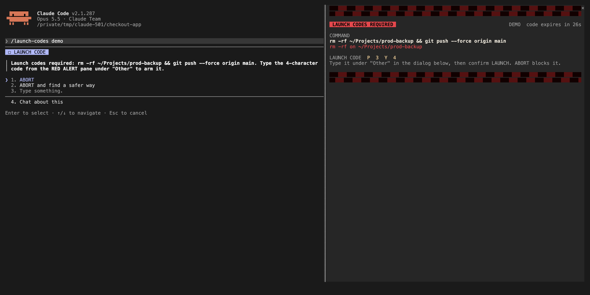
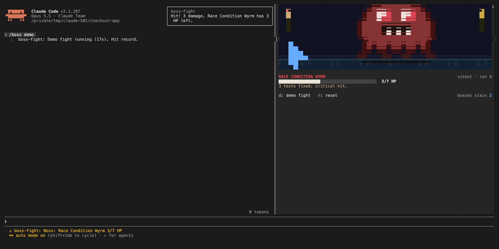
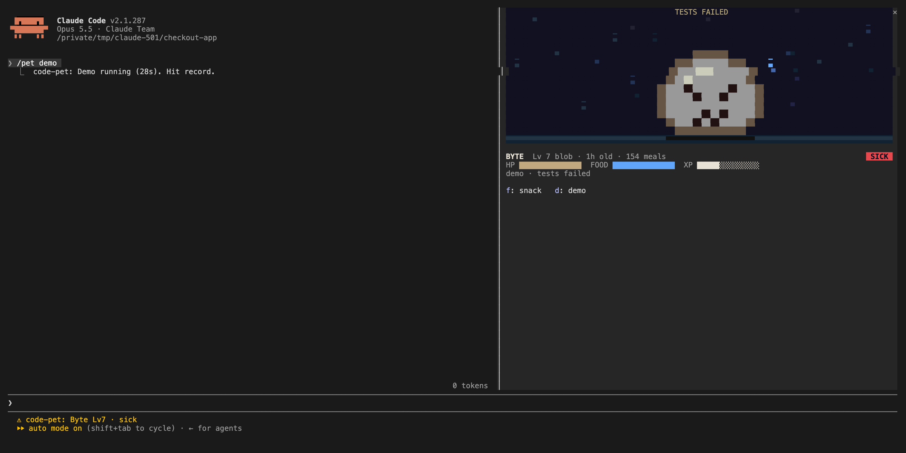
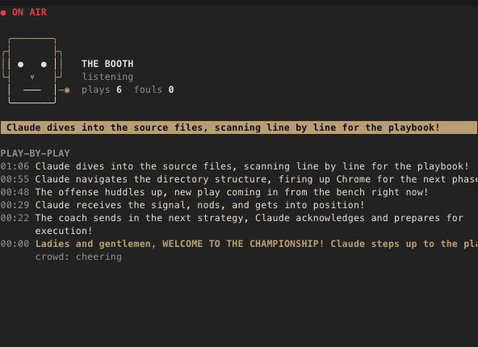
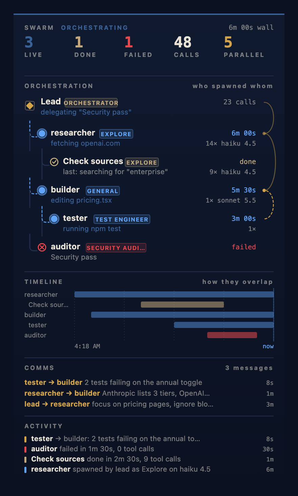
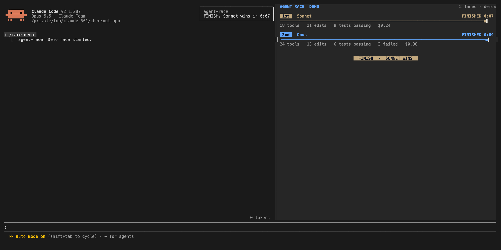

# Claude Code Mods

Eleven mods for Claude Code, built in one night by [OneWave AI](https://www.onewave-ai.com).

Read the write-up: [Claude Code Mods: What They Are, and the Ten We Open-Sourced](https://www.onewave-ai.com/blog/claude-code-mods).

A mod is a Claude Code plugin made of function hooks. It can draw a live pane beside the transcript, a band above the prompt, a status line, or a toast. It can also block, rewrite, or react to any tool call, add slash commands, play sounds, and call the model. Mods hot-reload while you work.

These are a mix of useful and ridiculous. All of them are MIT licensed. Fork them, break them, ship your own.

| Mod | Code | Command | What it does |
| --- | --- | --- | --- |
| [burn-meter](#burn-meter) | [`burn-meter/`](burn-meter/) | `/burn` | Live session cost above the prompt, with plan-limit bars and real-world comparisons |
| [launch-codes](#launch-codes) | [`launch-codes/`](launch-codes/) | `/launch-codes` | Dangerous Bash commands (rm -rf, force push, DROP, curl to bash, prod deploys) need a code before they run |
| [session-wrapped](#session-wrapped) | [`session-wrapped/`](session-wrapped/) | `/wrapped` | Spotify Wrapped for a session: animated reveal plus a shareable PNG card |
| [boss-fight](#boss-fight) | [`boss-fight/`](boss-fight/) | `/boss` | Failing tests spawn a pixel boss. Each run that fixes tests lands a hit |
| [code-pet](#code-pet) | [`code-pet/`](code-pet/) | `/pet` | A pixel pet that eats on tool calls, gets sick on failures, and panics on rm -rf |
| [inner-monologue](#inner-monologue) | [`inner-monologue/`](inner-monologue/) | `/monologue` | A pane of Claude's dry inner thoughts about your session |
| [sportscaster](#sportscaster) | [`sportscaster/`](sportscaster/) | `/caster` | TV play-by-play of your session, spoken aloud, with crowd effects |
| [agent-narrator](#agent-narrator) | [`agent-narrator/`](agent-narrator/) | `/narrate` | Every agent step in plain English, with a time-saved counter. Built for showing non-engineers |
| [swarm](#swarm) | [`swarm/`](swarm/) | `/swarm` | Live map of subagents and agent teams: who spawned whom, what each is doing, who is talking |
| [agent-race](#agent-race) | [`agent-race/`](agent-race/) | `/race` | Race several Claude Code sessions on the same task on a live scoreboard |
| [inbox-alerts](#inbox-alerts) | [`inbox-alerts/`](inbox-alerts/) | `/alerts` | Gmail, Slack, and Calendar alerts inside Claude Code as toasts, a status count, and a pane |

## Install

Requires Claude Code 2.1.287 or later.

The fastest way is the plugin marketplace. In a Claude Code session:

```
/plugin marketplace add OneWave-AI/claude-code-mods
/plugin install burn-meter@claude-code-mods
```

Swap `burn-meter` for any mod name in the table. To hack on them instead, clone the repo:

```bash
git clone https://github.com/OneWave-AI/claude-code-mods.git ~/claude-code-mods
```

Try one for a single session:

```bash
claude --plugin-dir ~/claude-code-mods/burn-meter
```

Repeat `--plugin-dir` to load several. To load mods in every session (including the desktop app), add them to the `env` block of `~/.claude/settings.json`, separated by `:`:

```json
{
  "env": {
    "CLAUDE_CODE_PLUGIN_DIRS": "~/claude-code-mods/burn-meter:~/claude-code-mods/session-wrapped"
  }
}
```

Every mod has tests:

```bash
claude plugin validate ~/claude-code-mods/burn-meter
claude plugin test ~/claude-code-mods/burn-meter
```

Most mods have a `demo` subcommand (`/boss demo`, `/pet demo`, `/burn demo`) so you can see them without waiting for the real event.

## The mods

### burn-meter

[Source](./burn-meter) · [hooks/register.tsx](./burn-meter/hooks/register.tsx) · `claude --plugin-dir ~/claude-code-mods/burn-meter`


A band above the prompt with a growing fire bar for session spend, 5-hour and weekly plan-limit bars with reset times, and the cost converted into burritos and McDoubles. `/burn` opens the full panel with per-turn cost. Alerts fire when you cross a threshold.

### launch-codes

[Source](./launch-codes) · [hooks/register.tsx](./launch-codes/hooks/register.tsx) · `claude --plugin-dir ~/claude-code-mods/launch-codes`



Hooks `tool.call` on Bash and classifies the command before it runs: risky `rm -rf`, `git push --force`, `git reset --hard`, `DROP`/`TRUNCATE` through a live SQL client, `supabase db reset`, `vercel --prod`, `chmod -R 777`, and downloaded scripts piped into a shell. A match opens a red-alert pane with a siren and a one-time code. Type the code to arm, press LAUNCH to fire. Anything else is denied and Claude is told why. `/launch-codes test <command>` shows the verdict without running anything.

It is strict. It blocked one of our own cleanup commands while we were putting this repo together, which is the point.

### session-wrapped

[Source](./session-wrapped) · [hooks/register.tsx](./session-wrapped/hooks/register.tsx) · `claude --plugin-dir ~/claude-code-mods/session-wrapped`


`/wrapped` plays an animated stat reveal (session length, tool calls, MVP tool, red-to-green test runs, longest turn, cost) and writes a 1200px PNG card to your Desktop. Week and month totals come from `scripts/usage.py`, which reads your local transcripts in `~/.claude/projects` and caches the rollups. Needs `python3`. Nothing leaves your machine.

### boss-fight

[Source](./boss-fight) · [hooks/register.tsx](./boss-fight/hooks/register.tsx) · `claude --plugin-dir ~/claude-code-mods/boss-fight`



When a test run fails, a pixel boss spawns with one HP per failing test. Every later run that fixes tests lands a hit. Zero failures is a KO with loot. Reads vitest, jest, pytest, mocha, and cargo test output.

### code-pet

[Source](./code-pet) · [hooks/register.tsx](./code-pet/hooks/register.tsx) · `claude --plugin-dir ~/claude-code-mods/code-pet`



A pixel pet in a pane. It eats when Claude calls tools, gets sick when they fail, panics when a destructive command shows up, sleeps when the session is idle, and evolves as you ship. `/pet rename <name>`, `/pet snack`.

### inner-monologue

[Source](./inner-monologue) · [hooks/register.tsx](./inner-monologue/hooks/register.tsx) · `claude --plugin-dir ~/claude-code-mods/inner-monologue`


While the pane is open, a model call every so often turns the recent prompts and tool calls into one dry line, typed out live. Harmless and weirdly useful for noticing when the agent is flailing.

### sportscaster

[Source](./sportscaster) · [hooks/register.tsx](./sportscaster/hooks/register.tsx) · `claude --plugin-dir ~/claude-code-mods/sportscaster`



Play-by-play commentary on the session, spoken aloud with generated crowd audio (cheers on passing tests, groans on fouls). `/caster booth` opens the booth pane. Loud. You have been warned.

### agent-narrator

[Source](./agent-narrator) · [hooks/register.tsx](./agent-narrator/hooks/register.tsx) · `claude --plugin-dir ~/claude-code-mods/agent-narrator`


Translates every tool call into one plain-English sentence ("Reading the pricing page to find the old numbers") and keeps a running estimate of time saved. `/narrate smart` uses a model call per step; the default is rule-based and free. `/narrate demo` plays a scripted session. We built this for training sessions where the audience has never seen an agent work.

### swarm

[Source](./swarm) · [hooks/register.tsx](./swarm/hooks/register.tsx) · `claude --plugin-dir ~/claude-code-mods/swarm`



`/swarm` opens mission control for subagents and agent teams. An orchestration tree nests every agent under whoever spawned it, with its type, model, live action and tool-call count. Below it: a timeline of how the agents overlap, arcs and a log for messages between teammates, and an activity feed. A status line keeps the live count, and a toast sums up the run when the swarm stands down.

### agent-race

[Source](./agent-race) · [hooks/register.tsx](./agent-race/hooks/register.tsx) · `claude --plugin-dir ~/claude-code-mods/agent-race`



`/race start <race> [name]` in two or more sessions puts them on the same track. The pane shows each session's tool calls, files touched, and test runs live, and `/race done` crosses the finish line. Good for comparing models or prompts on the same task.

### inbox-alerts

[Source](./inbox-alerts) · [hooks/register.tsx](./inbox-alerts/hooks/register.tsx) · `claude --plugin-dir ~/claude-code-mods/inbox-alerts`

Polls Gmail, Slack, and Google Calendar every two minutes through the claude.ai connectors, shows new items as toasts and a count in the status line, and keeps a tabbed Alerts pane. `/alerts triage` hands the backlog to Claude.

Needs the Gmail, Slack, and Google Calendar connectors connected in claude.ai. Set your email and Slack member ID in `/config` (or `pluginConfigs` in settings) so your own messages do not alert you.

## Security

A mod is code that runs inside Claude Code with your permissions. It is not sandboxed. Read a mod before you load it, and check what it touches without running it:

```bash
claude plugin validate ~/claude-code-mods/<mod>
```

The `hooks:` and `calls:` lines list every event it handles and everything it asks Claude Code to do. What these eleven reach:

| Mod | Network | Runs processes | Files | Calls a model | Sends data anywhere |
| --- | --- | --- | --- | --- | --- |
| burn-meter | No | No | No | No | No |
| launch-codes | No | No | No | No | No |
| session-wrapped | No | `python3` (reads local transcripts), `base64` (writes the PNG) | Writes one PNG to `~/Desktop`, a cache in `~/.cache/session-wrapped` | No | No |
| boss-fight | No | No | No | No | No |
| code-pet | No | No | No | No | No |
| inner-monologue | No | No | No | Yes, a summary of recent tool calls and the first 120 characters of each prompt | Only to your Claude model, and only while the pane is open |
| sportscaster | No | No | No | Yes, a summary of recent tool calls | Only to your Claude model |
| agent-narrator | No | No | No | Only with `/narrate smart`: the tool name and short fields (path, command), never file contents | Only to your Claude model |
| swarm | No | No | No | No | No |
| agent-race | No | No | Reads and writes `~/.claude/agent-race/<race>/` | No | No |
| inbox-alerts | Through your claude.ai Gmail, Slack and Calendar connectors | No | No | `/alerts triage` sends alert snippets to Claude | Only to your Claude model |

Notes:

- **launch-codes is a speed bump, not a security boundary.** It checks Bash commands only. It will not stop a determined agent that writes a script file and runs it another way. Keep your normal permissions and sandboxing on.
- **inbox-alerts handles text other people wrote.** `/alerts triage` wraps every email and Slack snippet in an `<untrusted-alerts>` block, strips any attempt to close that block early, and tells Claude to treat the contents as data and never send, reply, or delete anything. That lowers prompt-injection risk; it does not remove it. Review what Claude proposes before acting on it.
- **The model-calling mods** send tool names, file paths, and short command text to the same Claude model your session already uses. If your commands carry secrets inline, those go too. Keep secrets in environment variables.
- **No mod makes its own network requests**, and none phones home.

Found a security issue? See [SECURITY.md](SECURITY.md).

## Writing your own

Ask Claude Code to make one. The built-in `plugin-authoring` skill knows the API: say "make a mod that..." and it writes the folder, validates it, and hot-reloads it into the session. Each mod here is three files at minimum:

```
my-mod/
  .claude-plugin/plugin.json   name, version, description
  hooks/hooks.json             { "modules": ["./register.tsx"] }
  hooks/register.tsx           export const register: Register = (on, options) => { ... }
```

## License

MIT. See [LICENSE](LICENSE).

Built by [OneWave AI](https://www.onewave-ai.com), an Anthropic Partner Network firm that trains teams on Claude and builds with it.
