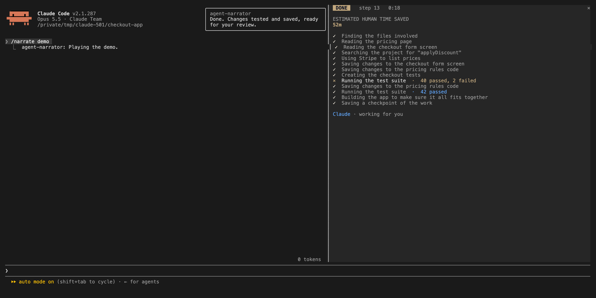

# agent-narrator

Watch the agent work: every step in plain English, with a live time-saved counter.



Translates every tool call into one plain-English sentence ("Reading the pricing page to find the old numbers") and keeps a running estimate of time saved. `/narrate smart` uses a model call per step; the default is rule-based and free. `/narrate demo` plays a scripted session. We built this for training sessions where the audience has never seen an agent work.

## Install

In a Claude Code session (2.1.287 or later):

```
/plugin marketplace add OneWave-AI/claude-code-mods
/plugin install agent-narrator@claude-code-mods
```

Or load this folder for one session: `claude --plugin-dir ./agent-narrator`

## What it reaches

| Mod | Network | Runs processes | Files | Calls a model | Sends data anywhere |
| --- | --- | --- | --- | --- | --- |
| agent-narrator | No | No | No | Only with `/narrate smart`: the tool name and short fields (path, command), never file contents | Only to your Claude model |

Run `claude plugin validate ./agent-narrator` to list every event it hooks and every call it makes. See the [repository README](../README.md#security) for the full security notes.

Part of [claude-code-mods](https://github.com/OneWave-AI/claude-code-mods) by [OneWave AI](https://www.onewave-ai.com). MIT licensed.
