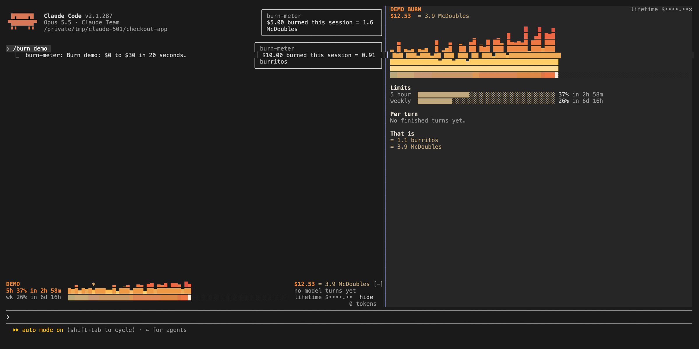

# burn-meter

Live session cost odometer above the prompt: a burning fuse, real-world comparisons, threshold alerts.



A band above the prompt with a growing fire bar for session spend, 5-hour and weekly plan-limit bars with reset times, and the cost converted into burritos and McDoubles. `/burn` opens the full panel with per-turn cost. Alerts fire when you cross a threshold.

## What the hooks do

Everything burn-meter shows comes from the session's own usage numbers, which Claude Code reports to the mod. It never reads your files, your environment variables or your credentials, never runs a process, and never sends anything off your machine. "Tokens" on this page always means model token counts, not login tokens.

- `session.start`: draws the band and registers `/burn`.
- `prompt.submit`: notes the session's cost at the moment you send a prompt, so it can show what that turn cost. It does not read or change the prompt, and passes it through untouched.
- `turn.complete`: adds the finished turn's token counts and cost to the per-turn chart, and shows a toast when spend crosses a threshold.
- `command.run` for `/burn`: opens the pane or toggles the band.
- `ui.render`: draws the band above the prompt and the `/burn` pane.

It stores two small values with Claude Code's own plugin storage: your running lifetime spend, and the last cost reading for the current session so a restart does not count the same spend twice.


In a Claude Code session (2.1.287 or later):

```
/plugin marketplace add OneWave-AI/claude-code-mods
/plugin install burn-meter@claude-code-mods
```

Or load this folder for one session: `claude --plugin-dir ./burn-meter`

## What it reaches

| Mod | Network | Runs processes | Files | Calls a model | Sends data anywhere |
| --- | --- | --- | --- | --- | --- |
| burn-meter | No | No | No | No | No |

Run `claude plugin validate ./burn-meter` to list every event it hooks and every call it makes. See the [repository README](../README.md#security) for the full security notes.

Part of [claude-code-mods](https://github.com/OneWave-AI/claude-code-mods) by [OneWave AI](https://www.onewave-ai.com). MIT licensed.
