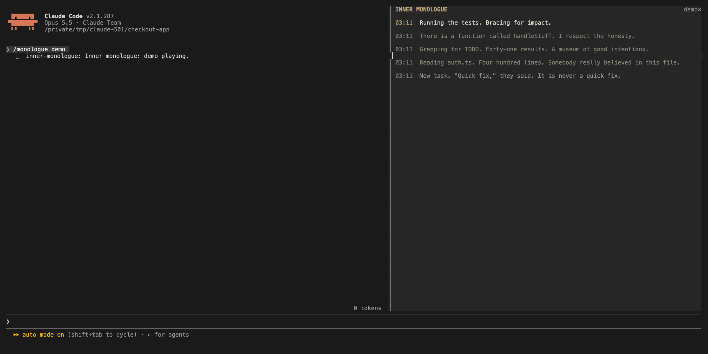

# inner-monologue

A pane of Claude's dry inner thoughts about your session, typed out live.



While the pane is open, a model call every so often turns the recent prompts and tool calls into one dry line, typed out live. Harmless and weirdly useful for noticing when the agent is flailing.

## Install

In a Claude Code session (2.1.287 or later):

```
/plugin marketplace add OneWave-AI/claude-code-mods
/plugin install inner-monologue@claude-code-mods
```

Or load this folder for one session: `claude --plugin-dir ./inner-monologue`

## What it reaches

| Mod | Network | Runs processes | Files | Calls a model | Sends data anywhere |
| --- | --- | --- | --- | --- | --- |
| inner-monologue | No | No | No | Yes, a summary of recent tool calls and the first 120 characters of each prompt | Only to your Claude model, and only while the pane is open |

Run `claude plugin validate ./inner-monologue` to list every event it hooks and every call it makes. See the [repository README](../README.md#security) for the full security notes.

Part of [claude-code-mods](https://github.com/OneWave-AI/claude-code-mods) by [OneWave AI](https://www.onewave-ai.com). MIT licensed.
