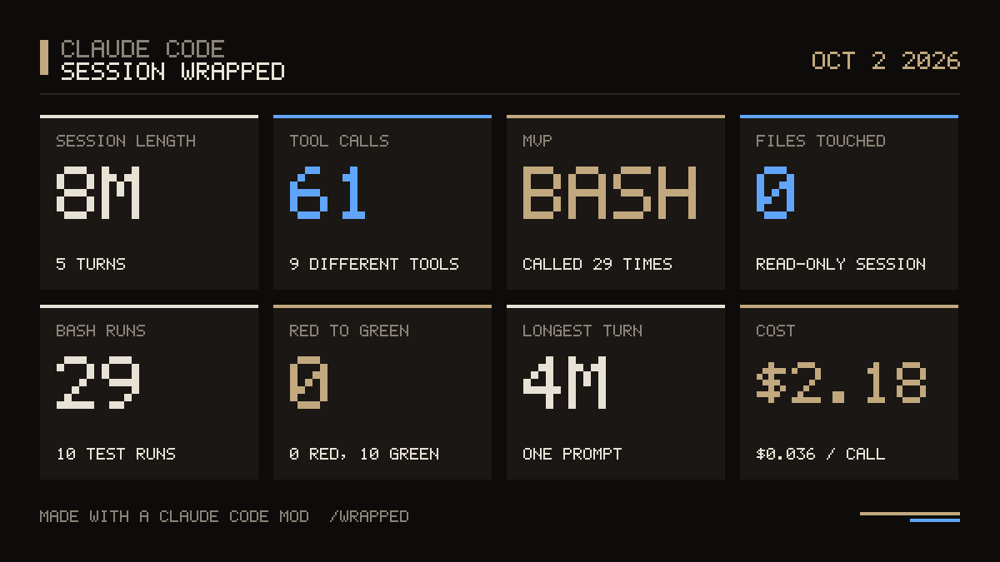

# session-wrapped

Spotify Wrapped for a Claude Code session: an animated stat reveal and a shareable PNG card.



`/wrapped` plays an animated stat reveal (session length, tool calls, MVP tool, red-to-green test runs, longest turn, cost) and writes a 1200px PNG card to your Desktop. Week and month totals come from `scripts/usage.py`, which reads your local transcripts in `~/.claude/projects` and caches the rollups. Needs `python3`. Nothing leaves your machine.

## Install

In a Claude Code session (2.1.287 or later):

```
/plugin marketplace add OneWave-AI/claude-code-mods
/plugin install session-wrapped@claude-code-mods
```

Or load this folder for one session: `claude --plugin-dir ./session-wrapped`

## What it reaches

| Mod | Network | Runs processes | Files | Calls a model | Sends data anywhere |
| --- | --- | --- | --- | --- | --- |
| session-wrapped | No | `python3` (reads local transcripts), `base64` (writes the PNG) | Writes one PNG to `~/Desktop`, a cache in `~/.cache/session-wrapped` | No | No |

Run `claude plugin validate ./session-wrapped` to list every event it hooks and every call it makes. See the [repository README](../README.md#security) for the full security notes.

Part of [claude-code-mods](https://github.com/OneWave-AI/claude-code-mods) by [OneWave AI](https://www.onewave-ai.com). MIT licensed.
